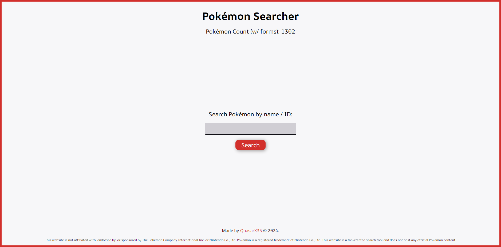
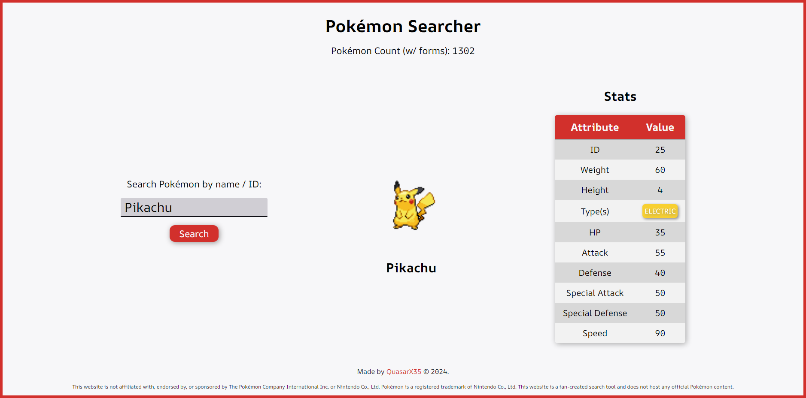
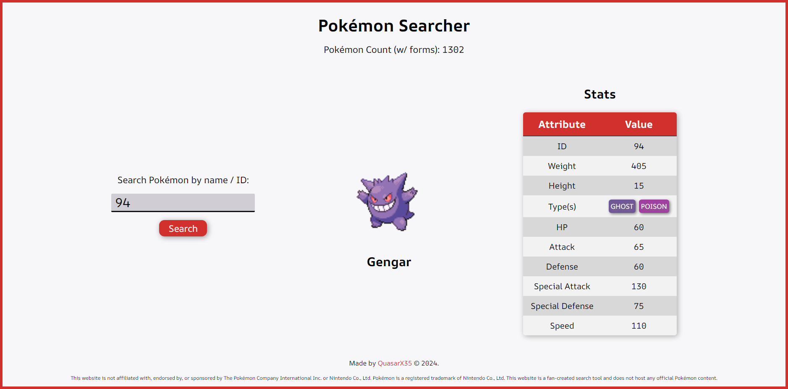
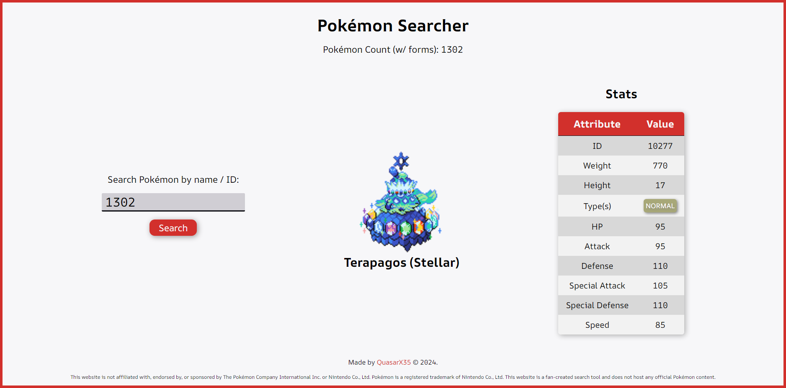
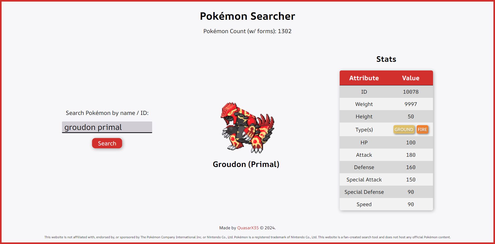
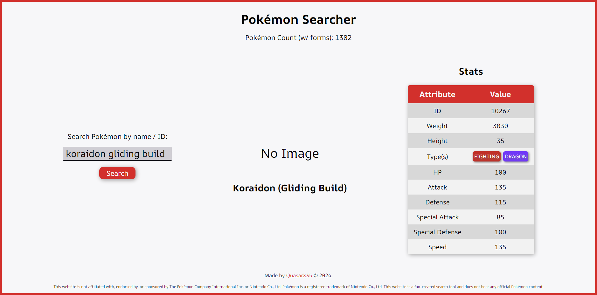
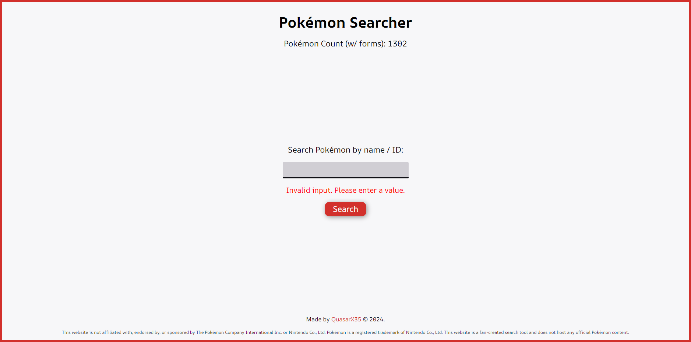
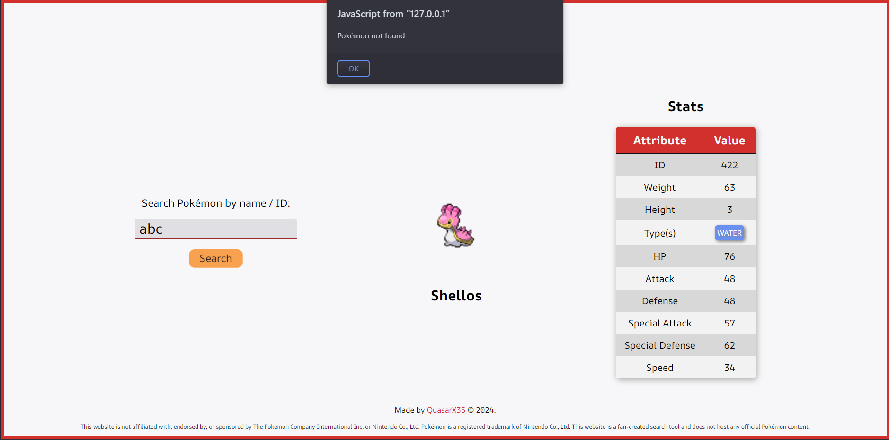

# Pokémon Searcher App
This JavaScript application allows you to search for information about your favorite Pokémon! It was built as a certification project for the FreeCodeCamp Javascript APIs and AJAX course. View the application [here]();

**Disclaimer**: This website is a fan-made project and is not affiliated with Pokémon or Nintendo in any way.

# Running the Application
- Enter a Pokémon name or ID in the search bar.
- Click the "Search" button or press Enter.
- The application will display information about the searched Pokémon if found, or an error message if the search is unsuccessful.

## Functionality
- Searches for Pokémon by name or ID using the PokéAPI.
- Displays detailed information about the searched Pokémon, including:
    - Name
    - ID number
    - Image sprite
    - Types
    - Base stats (HP, Attack, Defense, etc.)
- Provides a user-friendly search bar and informative presentation of Pokémon data.

# Technologies Used
- HTML: for structuring the user interface.
- CSS: for styling the layout and elements.
- JavaScript: for handling user interaction, fetching data from the freeCodeCamp PokéAPI, and displaying Pokémon information.

# Running the Application
- Clone this repository to your local machine.
- Open the index.html file in your web browser.
- Start editing any of the files.

## Screenshots

View the FreeCodeCamp challenge [here](https://www.freecodecamp.org/learn/javascript-algorithms-and-data-structures-v8/build-a-pokemon-search-app-project/build-a-pokemon-search-app).